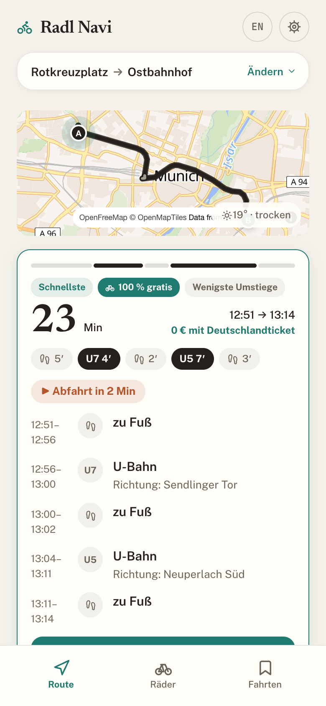
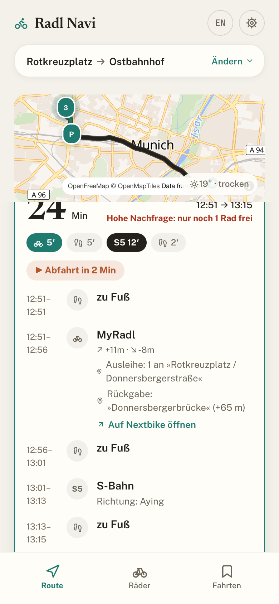
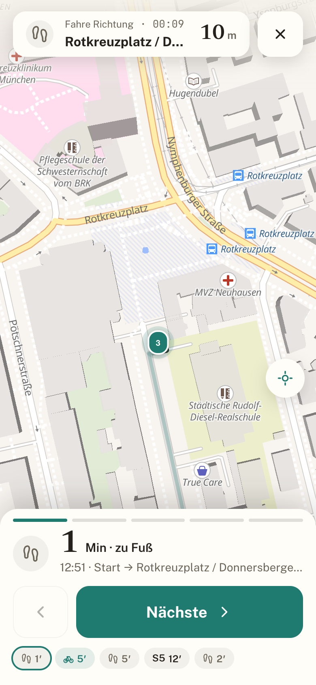
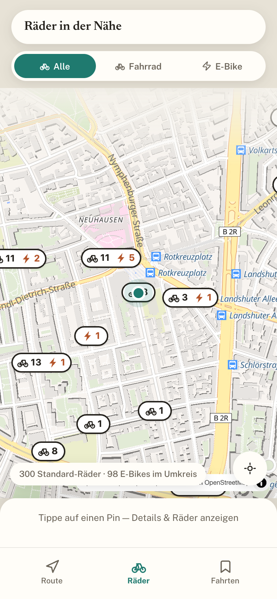

# 🚲 Radl Navi — MyRadl + MVV

[](https://github.com/neldosik/radl-nav/actions/workflows/tests.yml)
[](LICENSE)

Multimodaler Routenplaner für München: verbindet **Fußweg → MyRadl-Rad → ÖPNV**
zu einer durchgehenden Route, mit Live-Verfügbarkeit der Räder und einem Blick
auf die 30 Freiminuten. Diese Kombination bieten weder Google Maps noch MVGO.

Weitere nextbike-Städte (Berlin, Leipzig, Karlsruhe) sind in `src/stadt.ts`
hinterlegt und über das Hauptmenü wählbar; ohne bekannten Tarif nennt die App
dort keine Preise und keine Freiminuten.

Dazu: Los-Modus mit Etappenwechsel und Freiminuten-Uhr, Systemmeldung vor
Ablauf der Freiminuten, Störungsmeldungen der MVG zu den gefahrenen Linien,
teilbare Verweise auf eine Suche, Fahrtenbuch mit Sicherung (JSON) und
GPX-Ausgabe je Fahrt, sowie eine Diagnoseansicht zum Kopieren.

Privates, nicht-kommerzielles Projekt. **Kein Backend**: statische PWA, alle
verwendeten Schnittstellen sind offen und liefern CORS `*`.

**Live: https://neldosik.github.io/radl-nav/** (GitHub Pages, Zweig `gh-pages`)

<table>
  <tr>
    <td width="25%"></td>
    <td width="25%"></td>
    <td width="25%"></td>
    <td width="25%"></td>
  </tr>
  <tr>
    <td align="center"><sub>Verbindungen mit Preis und Freiminuten</sub></td>
    <td align="center"><sub>Ausleihe und <b>Rückgabe an einer Station</b></sub></td>
    <td align="center"><sub>Los-Modus mit Etappenwechsel</sub></td>
    <td align="center"><sub>Bestand rund um den Ausschnitt</sub></td>
  </tr>
</table>

**Gestaltung** „Papier & Petrol": warme Papierflächen (`#f4f1ea`), Petrol als
Akzent für alles Kostenlose (`#1f7a6f`), Terracotta für alles Kostenpflichtige
(`#b4552a`), Newsreader für Zahlen und Überschriften, Public Sans für den Rest.
Deutschsprachige Oberfläche mit englischer Umschaltung. Gestaltungsvariablen in
`src/index.css`, Symbole in `src/icons.tsx`.

## Entwicklung

Node 22 — die Version steht in `.nvmrc`, `nvm use` genügt. Unter Node 20
brechen `lint` und `build` ab: die nativen Teile von oxlint und rolldown gibt
es für diese Zeile nicht.

```bash
npm install
npm run dev        # http://localhost:5173/
npm test           # Tests der Rechenlogik (vitest)
npm run typecheck  # tsc -b, dieselbe Prüfung wie in der CI
npm run lint       # oxlint
npm run build      # Produktionsbündel nach dist/
npm run preview    # http://localhost:4173/ — das gebaute Bündel; nur hier zeigen sich Karten-, Arbeiter- und Bündelfehler
npm run size       # Bündelgrößen gegen die Grenzen prüfen (braucht dist/)
npm run test:e2e   # Rauchprobe im Browser (playwright, braucht Chromium)
npm run test:vertrag # Prüfung der fremden Schnittstellen (geht ins Netz)
```

Die Rauchprobe läuft gegen `vite preview`, also gegen das gebaute Bündel, und
fängt alle fremden Dienste ab (`tests/e2e/mocks.ts`). Einmalig braucht sie
`npx playwright install --with-deps chromium`.

`npm run test:vertrag` geht als einziger Lauf wirklich ins Netz und prüft, ob
Transitous, die GBFS-Feeds der eingerichteten Städte, Open-Meteo, die MVG und
OpenFreeMap noch die Felder liefern, mit denen die App rechnet. Deshalb ist er
nicht Teil von `npm test`, sondern läuft nachts eigenständig
(`.github/workflows/vertrag.yml`); ein Ausfall dort ist kein Fehler im Code.

### Veröffentlichen und zurückrollen

`gh-pages` hängt als eigenes Arbeitsverzeichnis (`git worktree`) unter
`.gh-pages/`. Jedes Deployment ist ein normaler Commit obendrauf, der Push
kommt ohne `-f` aus, die Historie bleibt erhalten.

Auf `main` passiert das von allein: `.github/workflows/deploy.yml` ruft nach
jedem Push dasselbe Skript auf. Von Hand geht es weiter genauso.

```bash
npm run deploy                    # bauen und veröffentlichen
npm run deploy:list               # letzte 20 Deployments: Zeit und Quell-Commit
npm run deploy:rollback           # ein Deployment zurück
npm run deploy:rollback -- a1b2c3 # auf ein bestimmtes Deployment
```

Der Rollback schreibt keine Historie um: der alte Dateibaum wird als **neuer**
Commit obenauf gelegt. So bleibt nachvollziehbar, wann zurückgegangen wurde,
und der Rollback des Rollbacks ist derselbe Handgriff.

Mit `DEPLOY_REMOTE=<remote>` lässt sich ein Deployment gegen ein Testrepository
fahren, ohne die Produktion anzufassen.

### Die Android-Hülle aktualisiert sich mit

Im Browser holt der Service Worker den neuen Stand. In der Hülle ist er
bewusst abgeschaltet — er legte sich vor die Auslieferung durch Capacitor und
schnitt die Brücke zu den Plugins ab, woran die Ortung scheiterte. Der Preis
war ein Webteil, der auf dem Stand der APK-Erstellung einfror.

`npm run deploy` legt deshalb neben den Deploy zwei weitere Dateien:

```
updates.json              Stand und Adresse des aktuellen Pakets
bundles/1.0.<n>.zip       der gebaute Webteil, die letzten fünf
```

Die Hülle sieht beim Start und beim Zurückkehren zur App nach (höchstens
stündlich, nicht während einer Fahrt, nicht im Datensparmodus), lädt das Paket
und setzt es **beim nächsten Start** ein — nie mitten in der Navigation.
Meldet sich ein neuer Stand nicht binnen 10 Sekunden mit `notifyAppReady()`,
verwirft ihn das Plugin und startet den vorherigen; ein fehlerhaftes
Deployment macht das Telefon also nicht unbrauchbar.

Die Nummer zählt Commits (`git rev-list --count HEAD`). Ein Deployment aus
einem unsauberen Arbeitsverzeichnis bekommt zusätzlich einen Zeitstempel,
sonst trüge ein zweiter Lauf desselben Commits dieselbe Nummer.

**Eine neue APK braucht es nur noch bei nativen Änderungen** — Plugins,
Berechtigungen, Capacitor selbst. Alles andere kommt über den Deploy an. Nach
einer neuen APK gilt zunächst wieder der eingebaute Stand (`resetWhenUpdate`),
damit kein alter Webteil gegen Plugins läuft, die er nicht kennt.

## Aufbau

| Datei | Zuständigkeit |
|---|---|
| `src/gbfs.ts` | reine GBFS-Parser: Standardräder von E-Bikes trennen, Stationsräder nicht doppelt zählen |
| `src/geo.ts` | Entfernungen, nächstgelegene Stationen, Abholplanung für Gruppen, Verdichtung freier Räder |
| `src/routing.ts` | Routenregeln: Filter (nur MyRadl, Zeitlimit, Radtyp), Rückgabestation, Suche |
| `src/stats.ts` | Kalorien (MET), CO₂ über die Strecke, Leihkosten — getrennt für E-Bike und Standardrad |
| `src/notify.ts` | Erinnerung „Rad zurückgeben" (LocalNotifications bzw. Notification API), geplant ab „Rad genommen" |
| `src/miete.ts` | laufende Ausleihe übersteht ein Neuladen — Grundlage der Freiminuten-Uhr |
| `src/stadt.ts` | Stadt, GBFS-Feed und Tarif als Konfiguration; Auswahl im Menü, Vorschlag per GPS |
| `src/stoerungen.ts` | Meldungen der MVG zu den gefahrenen Linien (Transitous liefert für München keine) |
| `src/verweis.ts` | Suche in der Adresszeile: teilbare Verweise, Neuladen ohne Verlust |
| `src/sicherung.ts` | Fahrtenbuch hinaus und herein (JSON) sowie je Fahrt als GPX |
| `src/kachelpuffer.ts` | Kartenkacheln in der Android-Hülle, wo kein Service Worker laufen darf |
| `src/mapStyle.ts` | Kartenstil samt Wiederholungen; meldet den endgültigen Ausfall an die Ansicht |
| `src/components/MapOutage.tsx` | Hinweis „Karte nicht geladen" mit Knopf zum Nachladen |
| `src/api.ts` | ausschließlich Netz: Transitous, GBFS, Open-Meteo |
| `src/history.ts` | Fahrtenbuch und Statistik (localStorage) |
| `src/hooks/useJourney.ts` | Los-Modus: GPS, Etappenwechsel, Bildschirm wachhalten |
| `src/hooks/useWakeLock.ts` | Bildschirm an: Capacitor KeepAwake → Wake Lock API → Video-Notnagel |
| `src/components/MapGuard.tsx` | fängt fehlendes WebGL ab — ohne Karte läuft der Rest weiter |
| `src/hooks/useTheme.ts` | heller und dunkler Modus |
| `src/App.tsx` | Zusammensetzen der Ansichten und Zustand der Suche |

Getestet ist die Rechenlogik (`gbfs`, `geo`, `routing`, `stats`, `notify`,
`format`, `polyline`, `verweis`, `sicherung`, `stadt`, `stoerungen`, `miete`,
`mapStyle`) — dort, wo ein Fehler nicht ins Auge fällt: Zählung der Räder, die
30 Freiminuten, die Routenfilter.

## Datenquellen

| Quelle | Liefert | Anmerkung |
|---|---|---|
| `api.transitous.org/api/v5/plan` | intermodales Routing (MOTIS, deutschlandweit) | ohne Schlüssel; Fair Use, nicht-kommerziell |
| `api.transitous.org/api/v1/geocode` | Adress- und Haltestellensuche | `place=48.137,11.575&placeBias=3` — sonst schlägt Duisburg Münchner Haltestellen |
| `gbfs.nextbike.net/.../nextbike_ml/de/*` | MyRadl-Stationen und Live-Bestand (ttl 60 s) | E-Bikes über `propulsion_type != human` |
| `.../free_bike_status.json` | Fahrzeugliste | 4682 Einträge, davon 422 wirklich freistehend — die übrigen stehen an Stationen und sind bereits in `station_status` enthalten (Stand 27.07.2026) |
| Google-Maps-Deeplinks | Turn-by-turn je Etappe | `/maps/dir/?api=1&travelmode=bicycling\|walking\|transit` |

### Wichtige Parameter für `plan`

- `preTransitRentalFormFactors=BICYCLE` (samt `post` und `direct`) — **notwendig**, sonst setzt MOTIS Dott-Roller in jede Route;
- `maxPre/PostTransitTime=1800` — Radzubringer bis 30 Minuten statt der voreingestellten 15;
- `maxDirectTime=2700` — sonst fallen reine Radrouten weg;
- Polylinien: Google Polyline, **Precision 6** (ab API v2).

### `returnConstraint`: warum die Navigation zum falschen Ziel führte (geprüft 27.07.2026)

MOTIS übernimmt die Rückgaberegel aus dem GBFS-Feed. Für freistehende Räder
steht dort `returnConstraint: NONE` — „überall abstellbar" —, woraufhin MOTIS
die Radetappe an einem beliebigen Punkt beendet; in der Praxis genau dort, wo
ein **anderes** freistehendes Rad steht. Messung an einer echten Antwort:
Etappenende 0 m vom nächsten freien Rad entfernt, 317 m zur nächsten Station.

Für MyRadl ist das falsch — außerhalb einer Station werden 20 € fällig. Einen
Serverparameter „nur an Stationen zurückgeben" gibt es in MOTIS nicht
(`ignore*RentalReturnConstraints` wirkt nur in die andere Richtung). Deshalb
korrigiert `routing.ts` das clientseitig: Das Etappenende wird auf die nächste
echte Station umgehängt (`returnSnapped`, Suchradius 1500 m), der Umweg zählt
gegen Zeitlimit und Freiminuten, und die Navigation führt dorthin
(`legTarget`). Maßgeblich ist `returnConstraint ∈ {ANY_STATION,
ROUNDTRIP_STATION}`; `toStationName` ist auch bei korrekten Etappen mitunter
leer und taugt nur als Ersatzsignal.

### Offline und Datenschutz

- Schriften liegen im Bündel (`src/fonts`, SIL Open Font License) — kein Aufruf
  zu `fonts.googleapis.com`, also auch ohne Netz vollständig und ohne
  IP-Weitergabe an Dritte;
- der Service Worker hält zwei getrennte Puffer: App-Hülle (Dokument,
  gebündelte Dateien, Schriften) und Kartenkacheln. Die App startet ohne Netz,
  die Stationsliste kommt dann aus dem `localStorage`-Puffer;
- Startbündel 82 kB gzip; maplibre-gl (273 kB gzip) wird erst mit der ersten
  Karte nachgeladen.

## Fallen, die uns schon Zeit gekostet haben

Keine davon lässt sich aus dem Code ableiten — man kann sie nur nachlesen
oder ein zweites Mal hineintreten. Alle am 28.07.2026 am Gerät festgestellt.

**Service Worker und die Capacitor-Hülle vertragen sich nicht.** Capacitor
liefert die Seite über einen eigenen lokalen Server aus und setzt dabei die
Brücke zur Hülle in das HTML ein — daher kommt `window.Capacitor` und damit
jedes Plugin. Ein Service Worker beantwortet ab dem zweiten Start den
Seitenaufruf aus seinem Puffer, und in der gepufferten Fassung fehlt die
Brücke. Das sieht dann aus wie ein Rechteproblem: `istNativ()` meldet falsch,
Plugins werden nie angesprochen, es erscheint nicht einmal ein Dialog. Der
Worker wird in der Hülle deshalb abgemeldet — erkannt an der *Herkunft*
(`https://localhost` ohne Port), nicht an `window.Capacitor`, denn genau das
fehlt ja. Den entfallenen Kachelpuffer übernimmt in der Hülle `kachelpuffer.ts`
(eigenes Schema `radlpuffer://` über maplibres `transformRequest`, Ablage in
der Cache Storage, die es auch ohne Worker gibt).

**`@capacitor/geolocation`: `interval` fehlt, also gilt `timeout`.** Steht
`interval` nicht in den Optionen, setzt die Android-Seite es auf den Wert von
`timeout`. Mit `timeout: 15000` wurde damit eine Messung **alle 15 Sekunden**
angefordert; schneller kam nur etwas, wenn zufällig eine andere App häufiger
fragte. Auf dem Rad sind das achtzig Meter je Messung.

**Und `maximumAge` steht dort auf 0.** Damit zählt keine vorhandene Messung,
es muss eine frische her — in Räumen dauert das lang oder gelingt nicht, und
der Aufruf lief in die Frist. Für „wo bin ich" genügt eine zwei Minuten alte.

**`enableHighAccuracy: true` wählt die Berechtigung mit aus.** Ab Android 12
verlangt das Plugin damit die *genaue* Freigabe. Ist am Gerät nur der
ungefähre Ort erlaubt, kommt eine Absage — von außen sieht das aus wie
„Berechtigung ist doch erteilt".

**iOS im Startbildschirm-Modus: die Seite ist kürzer als der Bildschirm.** Auf
einem 13 Pro 797 statt 844 Punkte — genau die 47 der Statusleiste, die oben
als Sicherheitsabstand ohnehin angerechnet werden. Unten bleibt ein Streifen.
Weder eine Farbe an `html` noch ein Füllfeld kommen dort an, und
`black-translucent` ändert nichts. Was hilft: `100lvh` als Höhe (nicht ein
gemessener Aufschlag — der misst sich selbst, siehe `luecke.ts`) und die
Reiterleiste aus der festen Verankerung in den Fluss nehmen.

**ImageMagick überspringt SVG mit XML-Kommentar.** Es meldet den Fehler nur
auf stderr und lässt die Zieldatei stillschweigend unverändert. Beim Erneuern
der Symbole blieben so drei Dateien alt — aufgefallen ist es erst beim
Vergleich der Eckfarbe (`-format "%[pixel:p{5,5}]"`).

**Fest verankerte Elemente werden in WebKit auf das Sichtfeld beschnitten.**
Ein `::after` an einer `position: fixed`-Leiste, das darüber hinausragt, wird
nicht gezeichnet. Eine Probe damit beweist deshalb nichts über die
Erreichbarkeit einer Fläche.

**`@testing-library` räumt nicht von selbst auf**, solange vitest seine
Funktionen nicht global bereitstellt. Ohne `cleanup()` im `afterEach` bleiben
die Ansichten früherer Prüfungen angemeldet und fangen fremde Ereignisse ab.
Und `history.length` wächst nach einem Rücksprung nicht mehr zuverlässig —
gezählt wird der Aufruf von `pushState`.

**`num_docks_available` ist in diesem Feed ohne Aussage.** Am 28.07.2026
meldeten 782 von 784 Stationen 0 freie Plätze und gleichzeitig
`is_returning: true` — die Stationen sind virtuelle Flächen ohne Ständer. Eine
Warnung „Station voll" darauf zu bauen, träfe fast überall zu und läge fast
überall falsch.

## Lizenz

MIT — siehe [LICENSE](LICENSE). Kartendaten © OpenStreetMap-Mitwirkende,
Kartenstil OpenFreeMap, Raddaten MyRadl/nextbike (CC0), Wetter Open-Meteo
(CC BY 4.0), Routing Transitous/MOTIS.

## MyRadl-Konditionen (geprüft 21.07.2026, myradl.de)

Die App rechnet mit diesen Regeln; sie sind an einer Stelle hinterlegt
(`src/stats.ts`) und lassen sich dort anpassen.

- 30 Freiminuten je Ausleihe auf dem Standardrad, nur mit ÖPNV-Abo
  (Deutschlandticket genügt); danach 1 €/30 Min, gedeckelt bei 9 €/24 h;
- E-Bike ist immer kostenpflichtig (1,50 €/30 Min mit Abo);
- die Freiminuten gelten **je Ausleihe**. Bei langen Radetappen weist die App
  deshalb auf eine Station etwa in der Mitte hin, an der sich das Rad wechseln
  lässt — die Fahrt bleibt damit innerhalb der Freiminuten;
- Rückgabe ausschließlich an offiziellen Stationen, außerhalb 20 € Gebühr;
- Reservierung in der offiziellen App: max. 15 Minuten, bis zu 4 Räder je Konto.
